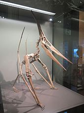

# The Ptask

### The Ptask is a behavioral arena heavily inspired by three existing behavioral tasks.  The Monster Box was originally created by the Watabe-Uchida Lab by Iku Kimura and Brett Graham (Tsutsui-Kimura et al., 2022).  The Two-armed bandit task for mice was originally created by Linda Wilbrecht (***).  The Looming Stimulus setup was originally designed by Yilmaz and Meister (2013), and the use in this experiment was inspired by work from the lab of Tiago Branco (Lenzi et al., 2022).  

## Introduction

### This is a detailed guide to building and operating the Ptask behavioral arena.  Whereas the Mosnter task was based on the Teensy platform, the Ptask uses an Arduino R3.  Although Teensy likely has certain advantages, Arduino is capable of running the same operations, and is more accessible to those who have limited engineering experience.  The Arduino Uno is one of the most popular development boards in production, and as such is usually easy to get a hold of (PJRC has been having backorder issues recently).

### Other changes from the Monster Task include: 
### 1) lighter "monster" in the form of a foam pterodactyl toy allowing for the use of a smaller arduino compatible motor instead of the large and difficult to program teknic motor required to move the heavy dinosaurs of the past.  
### 2) The use of stackable arduino shields in the place of certain breakout boards that were not easily compatible with teensy.  
### 3) Two speakers on either side of the "monster" end of the cage, to allow for studies testing the effect of stereo audio.
### 4) Flexibility in the Identity of the Predator
### 5) Use of nose port entry to initiate a trial and nose port lick tubes, rather than floor mounted lick tubes.  

###List of Materials: https://docs.google.com/spreadsheets/d/1Lh0VRICVWp91Xj_S3SuwVECsTs8IGjlc8RMTBrCVKcQ/edit?usp=sharing
